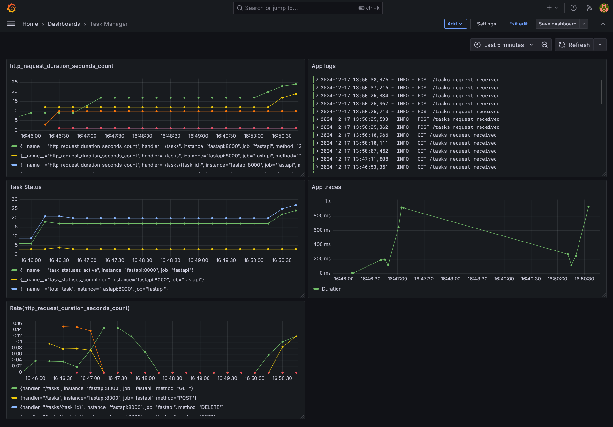

# Task Manager API

**Task Manager API** – это REST API для управления задачами с использованием FastAPI, SQLAlchemy и Prometheus для
мониторинга.

## Структура проекта

```
task_manager_api/
├── app/
│   ├── routers/         
│       ├── tasks.py     # Эндпоинты
│   ├── crud.py          # CRUD-операции
│   ├── database.py      # Подключение к базе данных
│   ├── main.py          # Точка входа
│   ├── models.py        # Модели базы данных
│   ├── schemas.py       # Схемы Pydantic
├── docs/
│   ├── openapi.yaml     # Документация API
├── Dockerfile           # Конфигурация Docker
├── prometheus.yml       # Конфигурация Prometheus
├── docker-compose.yml   # Конфигурация Docker Compose
├── requirements.txt     # Зависимости Python
├── README.md            # Описание проекта
└── tasks.db             # SQLite база данных
```

---

## Требования

- Python 3.8+
- SQLite (встроен в Python)
- Установленные зависимости из `requirements.txt`
- Docker и Docker Compose (для контейнеризации)

---

## Установка

### 1. Клонирование репозитория

Клонируйте проект из репозитория:

```bash
git clone https://github.com/AnastasiaTomson/task_manager_api.git
cd task_manager_api
```

### 2. Создание виртуального окружения

Создайте виртуальное окружение и активируйте его:

```bash
python -m venv venv
source venv/bin/activate  # Для Windows: venv\Scripts\activate
```

### 3. Установка зависимостей

Установите все необходимые зависимости:

```bash
pip install -r requirements.txt
```

### 4. Настройка базы данных

База данных будет создана автоматически при запуске сервера с использованием SQLite.

Если хотите изменить базу данных, настройте `SQLALCHEMY_DATABASE_URL` в файле `app/database.py`:

```python
# app/database.py
SQLALCHEMY_DATABASE_URL = "sqlite:///./tasks.db"  # Укажите путь к базе данных
```

---

## Запуск проекта

### 1. Локальный запуск приложения

Для запуска приложения используйте Uvicorn:

```bash
uvicorn app.main:app --reload
```

Это запустит сервер на `http://127.0.0.1:8000`.

### 2. Работа с API

Документация Swagger UI доступна по адресу: [http://127.0.0.1:8000/docs](http://127.0.0.1:8000/docs).

OpenAPI документация доступна по адресу: [http://127.0.0.1:8000/openapi.yaml](http://127.0.0.1:8000/openapi.yaml).

### 3. Эндпоинты

- **Получить список задач**:
  ```bash
  GET /tasks
  ```

- **Получить задачу по ID**:
  ```bash
  GET /tasks/{task_id}
  ```

- **Создать новую задачу**:
  ```bash
  POST /tasks
  {
      "title": "Новая задача",
      "description": "Описание задачи",
      "status": "В процессе"
  }
  ```

- **Обновить задачу**:
  ```bash
  PUT /tasks/{task_id}
  {
      "title": "Новая задача",
      "description": "Описание задачи",
      "status": "завершено"
  }
  ```

- **Удалить задачу**:
  ```bash
  DELETE /tasks/{task_id}
  ```

---

## Мониторинг с использованием Prometheus и Grafana

Проект включает сбор метрик через Prometheus и визуализацию данных в Grafana.

### 1. Настройка Prometheus

#### Конфигурация (`prometheus.yml`):

```yaml
global:
  scrape_interval: 15s
  evaluation_interval: 15s
scrape_configs:
  - job_name: "fastapi"
    metrics_path: "/metrics"
    scrape_interval: 5s
    static_configs:
      - targets: [ "fastapi:8000" ]
```

#### Запуск Prometheus:

```bash
prometheus --config.file=prometheus.yml
```

Prometheus будет доступен по адресу: `http://localhost:9090`.

### 2. Настройка Grafana

1. Установите Grafana.
2. Запустите сервер Grafana: 
    ```bash 
    grafana-server 
    ```
3. Перейдите в `http://localhost:3000` и войдите (по умолчанию логин и пароль: `admin`).
4. Добавьте источник данных Prometheus:
    - URL: `http://localhost:9090`.
5. Импортируйте дашборд с помощью JSON или готового ID из [Grafana Dashboards](https://grafana.com/grafana/dashboards/).


---

## Запуск через Docker Compose

Проект поддерживает запуск через Docker Compose, включая приложение, Prometheus и Grafana.

### 1. Команда запуска

```bash
docker compose up --build
```

### 2. Доступ к сервисам

- FastAPI: `http://localhost:8000`
- Prometheus: `http://localhost:9090`
- Grafana: `http://localhost:3000`

---